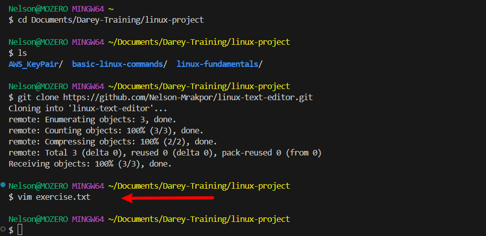
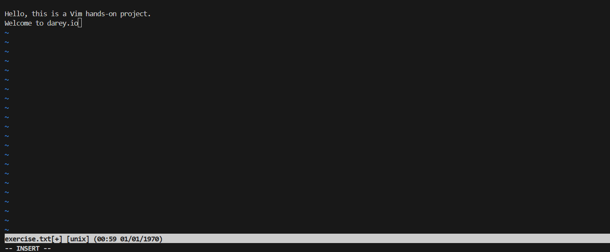
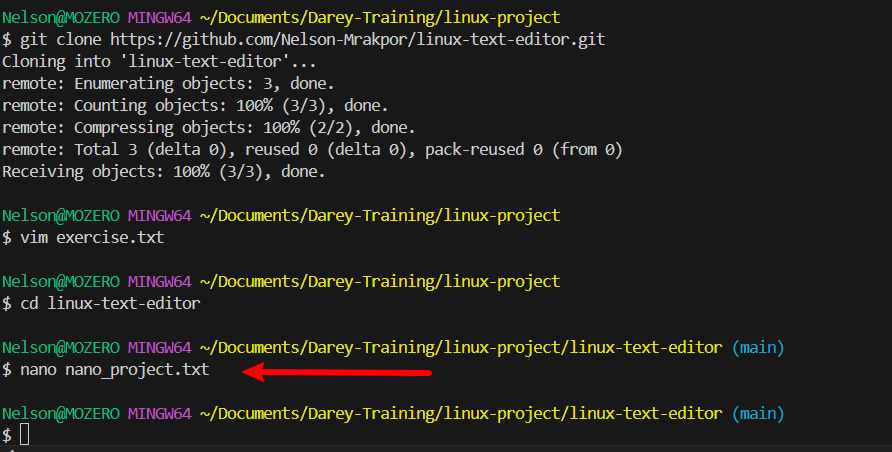
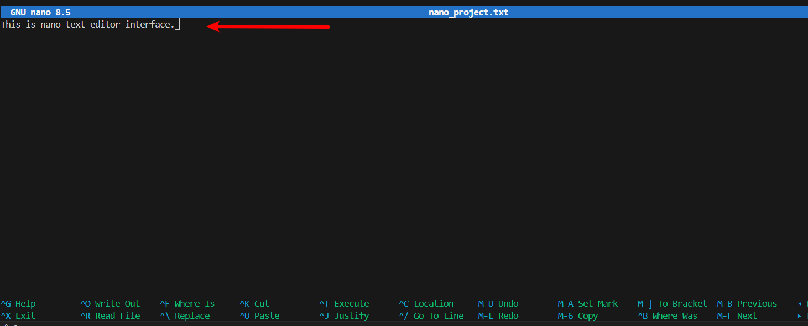

# Linux Text Editors

This project demonstrates the use of text editors in the Linux environment.

A Linux text editor is a software application specifically designed to create, modify, and manage text files on a Linux-based operating system. These editors allow users to interact with and manipulate plain text files, configuration files, scripts, and other text-based documents.

---

## VIM Text Editor

The **VIM** text editor, short for **"Vi Improved"**, is a powerful and versatile text editing tool in the Unix and Linux ecosystem. It offers an extensive set of features, modes, and commands that empower users to manipulate text efficiently.

### Working with VIM

Create and open a file named `exercise.txt` using the following command:

```bash
vim exercise.txt
```

This command opens the file if it exists. If it does not exist, it creates the file and then opens it.



### Manipulating the File

- Press `i` to enter **insert mode**.
- Type in your desired text.



#### Navigation

You can move around using the **arrow keys** or the following keys:
- `h`: move left
- `j`: move down
- `k`: move up
- `l`: move right

#### Deleting Text

- Press `Esc` to exit insert mode.
- Move the cursor to the character you want to delete and press `x`.
- To delete an entire line, move the cursor to the beginning of the line and press `dd` (press `d` twice).

#### Undoing Changes

- Press `Esc` to ensure you're in normal mode, then press `u` to undo the last change.

#### Saving and Exiting

- Save changes and exit: Press `Esc`, then type `:wq` and press `Enter`.  
  *(w = write, q = quit)*

- Quit without saving: Press `Esc`, then type `:q!` and press `Enter`.

---

## Nano Text Editor

**Nano** is a user-friendly and straightforward text editor in the Linux ecosystem. It is an excellent choice for users who are new to the command line or those who prefer a more intuitive editing experience. Nano is versatile and lightweight, ideal for performing quick edits, writing scripts, or making configuration changes from the command line.

### Working with Nano Editor

Create and open a file named `nano_project.txt` using the following command:

```bash
nano nano_project.txt
```

If the file exists, it will be opened; otherwise, it will be created and then opened.



Entering text in Nano is straightforward — just start typing like in any regular text editor.

#### Saving and Exiting

- To save changes: Press `Ctrl + O`, confirm the filename, then press `Enter`.
- To exit Nano: Press `Ctrl + X`. If there are unsaved changes, you will be prompted to save before exiting.



To open an existing file (if available), use the command:

```bash
nano existing-file.txt
```